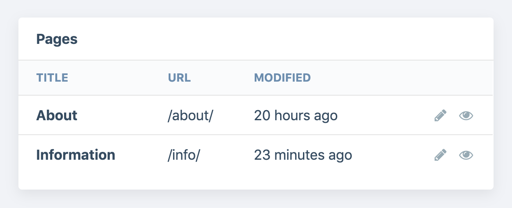
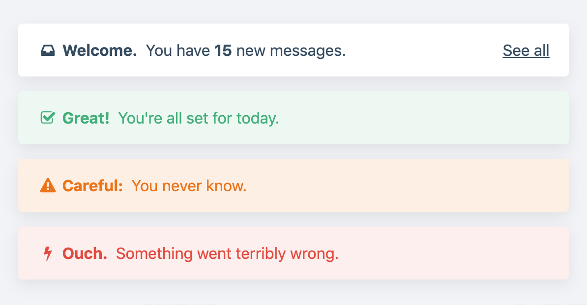
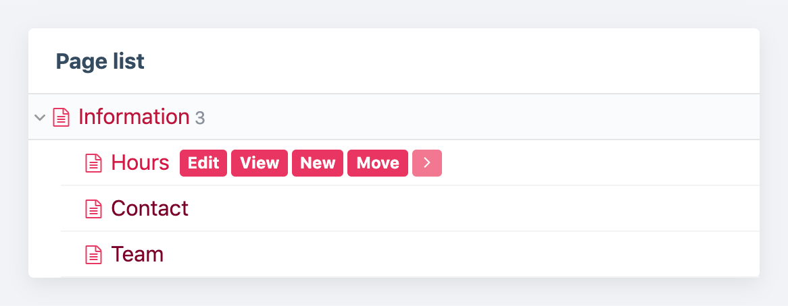
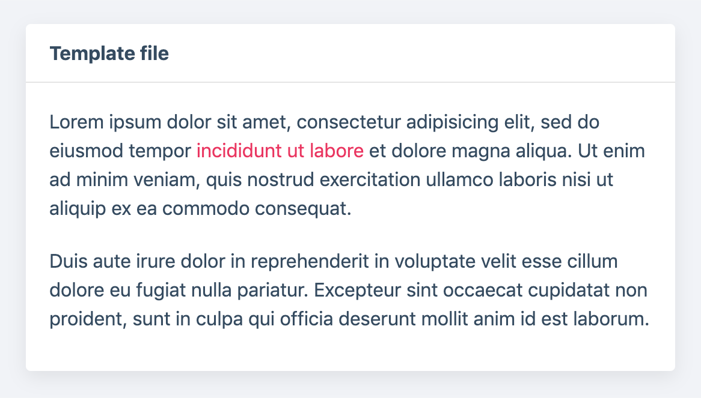

# ProcessWire Dashboard

Display a configurable dashboard in ProcessWire's admin interface. Comes with a set of pre-defined panel types but can be extended easily to display any content you want.


## Installation

Install the module by either copying the folder into your `/site/modules/` directory or installing it via the admin interface.

Upon installation, a dashboard page is created. To access the dashboard, users need to have the permission `dashboard-view`.

### Dashboard as entry point

The dashboard can be configured to serve as the default entry point of the admin interface. In this case, users will see the dashboard after login and can return to it by clicking the ProcessWire logo. The page list can then only be accessed by clicking the `Pages` menu item.

To use the dashboard as entry point, you need to edit the `Admin` page (ID `2`) and manually assign the process `Dashboard`. Make sure to restore it to `ProcessHome` in case you decide to uninstall the dashboard module.

## Requirements

Currently tested and supported only for the current `dev` branch of ProcessWire (version 3.0.143 and up). It may well work with older versions, I can't however give any guarantuees. Also, tested in recent versions of Chrome only.

## Adding Panels

Panels are added via a hook. The method's return value is a WireArray, which means you can just `add()` your panels.

All configuration is done by code. This meets two objectives: the dashboard config can be version-controlled and sensitive credentials are never stored in the database. You are free to supply the data any way you want, preferably using environment variables.

```php
/* site/templates/admin.php */

wire()->addHookAfter('Dashboard::getPanels', function ($event) {
  /* Get list of panels */
  $panels = $event->return;

  /* Add panels */
  $panels->add([
    'panel' => 'collection',
    'title' => 'News items',
    'data' => [
      'collection' => 'template=news-item, limit=10',
      'sortable' => true,
    ],
  ]);
});
```

### Removing panels

Since the panel collection is a WireArray, you can filter and remove existing panels in later hooks.

```php
/* Remove all chart panels */
$charts = $panels->find('panel=chart');
foreach ($charts as $panel) {
  $panels->remove($panel);
}
```

### Nesting panels

See the section [Panel Groups](#panel-groups) for information about grouping and nesting panels.

## Configuration

Each panel configuration is a simple associative array holding the following global configuration keys. The only required option is `panel`. Each panel might additionally require one or more keys in the `data` array to display correctly.

- `panel`: The panel type (string, required)
- `size`: The width of the panel (string, default: `normal`)
  - `small`: one third
  - `normal`: half
  - `large`: two thirds
  - `full`: full width
- `layout`: an associative array of layout options
  - `centerTitle`: Center the panel's title (bool, `false` by default)
  - `minimal`: Display the panel without background, border and shadow (bool, `false` by default)
  - `padding`: Display the panel contents with padding (bool, `true` by default)
- `title`: Title displayed in the panel header (set to empty string to hide header completely)
- `icon`: Icon displayed in the panel header (FontAwesome code without leading `fa-`)
- `data`: The data required by the panel type. See the readme section on each panel for information about required keys.


```php
/* Example using all options */

$panels->add([

  /* Global options */
  'panel'  => 'collection',
  'size'   => 'full',
  'layout' => ['centerTitle' => true],
  'title'  => 'News items',
  'icon'   => 'newspaper-o',

  /* Options specific to each panel type */
  'data' => [
    'collection' => 'template=news-item, limit=10',
    'sortable'   => true,
  ],

]);
```

## Included Panels

The module comes bundled with a set of pre-defined panel types.

All panel-specific options are supplied under the `data` key of the panel's configuration array. See the sections below for options specific to each panel type.

|Image|Panel|Class name|Content|
|---|---|---|---|
|[](#chart)|`chart`|DashboardPanelChart|Chart.js chart|
|[](#collection)|`collection`|DashboardPanelCollection|List of pages in a table|
|[](#notice)|`notice`|DashboardPanelNotice|Notification-style message|
|[](#number)|`number`|DashboardPanelNumber|Large number with trend indicator|
|[](#pagelist)|`page-list`|DashboardPanelPageList|ProcessPageList widget|
|[](#shortcuts)|`shortcuts`|DashboardPanelShortcuts|List of links with icons|
|[](#template)|`template`|DashboardPanelTemplate|Render file in template folder|

### Chart

Display a chart using [Chart.js](https://www.chartjs.org/).


#### Options

- `chart`: array of configuration options to pass to Chart.js (converted to JSON)

#### Example

```php
[
  'chart' => [
    'type' => 'line',
    'data' => [
      'labels' => ['Jan', 'Feb', 'Mar', 'Apr', 'May', 'Jun', 'Jul'],
      'datasets' => [
        [
          'label' => 'Lorem ipsum',
          'data' => [7, 10, 8, 12, 4, 6, 3],
        ],
        [
          'label' => 'Dolor sit amet',
          'data' => [5, 6, 7, 8, 6, 8, 14],
        ],
      ],
    ],
    'options' => [
      'aspectRatio' => 2.5,
      'scales' => [
        'xAxes' => [
          ['gridLines' => ['display' => false]],
        ],
      ],
    ],
  ],
]
```

### Collection

Display a collection of pages in a table. Supply either a PageArray or a selector string.


#### Options

- `collection`: PageArray or selector string (required)
- `columns`: columns to display (array, `title` and `url` by default)
- `actions`: array of actions to allow, or `false` to disable Actions column (`edit` and `view` by default)
- `pagination`: display pagination info if PageArray has a `limit` set? (bool, `true` by default)
- `sortable`: make table columns sortable (bool, `false` by default)
- `showHeaders`: show table headers? (bool, `true` by default)
- `dateFormat`: date format to use for DateTime columns (`relative` by default)
- `maxImageNum`: number of thumbnails to show for image columns (`1` by default)

#### Example

```php
[
  'collection' => 'template=news-item, limit=10',
  'sortable' => true,
  'columns' => [
      'title' => 'Title',
      'url' => 'URL',
      'modified' => 'Modified',
  ],
]
```

#### Complex markup

Columns support dot syntax and curly brackets to access sub-fields:

```php
'columns' => [
  'category.title' => 'Category',
  'createdUser.name' => 'Created by',
  'On {location.street} in {location.city}' => 'Location',
]
```

#### Image columns

Pass the name of any image field as the column key to display thumbnails. Only the first image is shown by default, but you can change the number of images shown by setting the `maxImageNum` option.

```php
[
  'columns' => [
      'images' => 'Thumbnails',
  ],
  'maxImageNum' => 4,
]
```

#### Page icon columns

Add the column `page_icon` to display page icons in their own column.

```php
'columns' => [
  'page_icon' => ''
]
```

#### Icon as table header

To display an icon as table header, pass the FontAwesome icon code as column title (including the `fa-` prefix).

```php
'columns' => [
  'thumbnail' => 'fa-eye'
]
```

### Notice

Display a notice with icon and actions. If set, the panel's `title` will be displayed inline and in bold instead of inside a panel header.


#### Options

- `message`: notice to display (string, required)
- `status`: status of the notice (string: one of either `success`, `warning` or `error`; `notice` by default)
- `actions`: additional links to display (array of format `['Label' => 'url']`)

#### Example

```php
/* Plain with actions */
[
  'message' => 'You have <b>15</b> new messages.',
  'actions' => [
    'See all' => '/inbox/',
  ],
]

/* With status */
[
  'message' => 'Something went wrong.',
  'status' => 'error',
]
```

### Number

Display a large number with trend indicator.


#### Options

- `number`: the number to display (string or int/float, required)
- `detail`: additional information to display below (string)
- `trend`: trend to indicate with green/red arrows (string, either `up` or `down`)
- `locale`: locale to use for formatting numbers (string)

#### Example

```php
[
  'number' => 484,
  'detail' => 'up 5% from last week',
  'trend' => 'up',
]
```

### PageList

Display a ProcessPageList widget.


#### Options

- `parent`: the root page ID to render the page list for (int, homepage by default)
- `showRootPage`: whether to include the root page in the output (bool, `true` by default)

#### Example

```php
[
  'parent' => $this->pages->get('template=info')->id,
  'showRootPage' => true,
]
```

### Shortcuts

Display a list of shortcuts as links with icons.


#### Options

- `shortcuts`: array of Pages or page IDs to display (array, required)
- `fallbackIcon`: icon to use if page doesn't have one (string, `bookmark-o` by default)
- `icon`: force one icon for all pages (string, off by default)

#### Example

```php
[
  'shortcuts' => [
       304,  // Profile
      1065,  // Settings
      1026,  // Cache admin
      1020,  // Upgrades
      1016,  // Sessions
  ],
  'fallbackIcon' => 'star-o',
]
```

### Template

Display the output of any file in your template folder. The file will receive all API variables and any additional view variables you specify.


#### Options

- `template`: template file name, relative to `/site/templates/` and including extension (string, required)
- `variables`: variables to pass into the template (array, empty by default)

#### Example

```php
/* Panel config */
[
  'template' => 'dash.php',
  'variables' => [
    'text' => 'Lorem ipsum dolor ...',
  ],
]

/* Template file: site/templates/dash.php */

echo $text;
```

## Creating Custom Panels

To create custom panels, simply extend the DashboardPanel base class. See [DashboardPanelHelloWorld](./DashboardPanelHelloWorld.module) for an example implementation.

Every panel module **must** implement the `getContent()` method that returns the rendered markup for the panel body. Everything else is optional.

- `setup()`: called before rendering to fetch data, setup variables, etc.
- `getContent()`: return the panel's body markup (required, string)
- `getTitle()`: return the panel's title (string)
- `getIcon()`: return an icon code to display next to the title (string)
- `getFooter()`: return the rendered markup for the panel footer (string)
- `getClassNames()`: return additional class names for the panel div (array)
- `getStyles()`: return styles to load (array of filenames or URLs)
- `getScripts()`: return scripts to load (array of filenames or URLs)

Module assets will be included automatically as long as they're named accordingly (`DashboardPanelHelloWorld.css` and `DashboardPanelHelloWorld.js` respectively).

### Accessing Config & Data

Every module derived from the DashboardPanel base class has a few properties populated automatically:

- `$this->options`: Global panel options like title, icon, etc (array)
- `$this->data`: Panel-specific configuration (array)
- `$this->size`: Panel size (string, sanitized to one of allowed values)
- `$this->layout`: Layout options of this panel instance (array)

### Helpers

The panel base class has a few helpers for common tasks.

#### DashboardPanel::renderTable

Render a table using ProcessWire's built-in `MarkupAdminDataTable` module. Returns HTML.

If the `header` option is true, the first row will be displayed as a header row. Same for `footer`.

```php
/* Usage with default values */

$rows = [
  ['Title', 'Date'],
  ['Lorem ipsum', '1.12.2019'],
];

$html = $this->renderTable($rows, [
  'header'   => false,
  'footer'   => false,
  'entities' => false,
  'sortable' => false,
  'class'    => '',
]);
```

#### DashboardPanel::renderIcon

Render a FontAwesome icon in fixed width.

```php
$icon = $this->renderIcon('star');
```

#### DashboardPanel::view

Render a template file in a `views` sub-directory relative to the module file. Passes all ProcessWire API variables as well as user-supplied variables.

```php
/* Render ./views/content.php and pass a $title var */

$markup = $this->view('content', [
  'title' => 'Lorem ipsum'
]);
```

## Panel Groups

Panels can be displayed in a nested grid by creating groups. Each group can have a `title` and add extra `margin` below. To control vertical alignment inside the group, set the `align` property to one of `top`, `bottom`, `center`, `distribute` or `fill` (`fill` by default).

*Screenshots & examples coming soon.*

```php
/* Create a group */
$group = $panels->createGroup([
    'size' => 'normal',
    'title' => 'Notifications',
    'align' => 'top',
    'margin' => true,
]);
$panels->add($group);

/* Nest panels below */
foreach (getNotifications() as $message) {
  $group->add([
    'panel' => 'notice',
    'size'  => 'full',
    'data'  => ['message' => $message],
  ]);
}
```

## Customizing the Headline

Use the `getHeadline` hook to set the main headline or hide it by returning an empty string.

```php
wire()->addHookAfter('Dashboard::getHeadline', function ($event) {
  $event->return = 'Instrumententafel';
});
```

## License

This program is free software; you can redistribute it and/or modify it under the terms of the GNU General Public License as published by the Free Software Foundation; either version 3 of the License, or (at your option) any later version.

This program is distributed in the hope that it will be useful, but WITHOUT ANY WARRANTY; without even the implied warranty of MERCHANTABILITY or FITNESS FOR A PARTICULAR PURPOSE. See the GNU General Public License for more details.

You should have received a copy of the GNU General Public License along with this program; if not, write to the Free Software Foundation, Inc., 51 Franklin Street, Fifth Floor, Boston, MA 02110-1301, USA.

(See included LICENSE file for full license text.)
