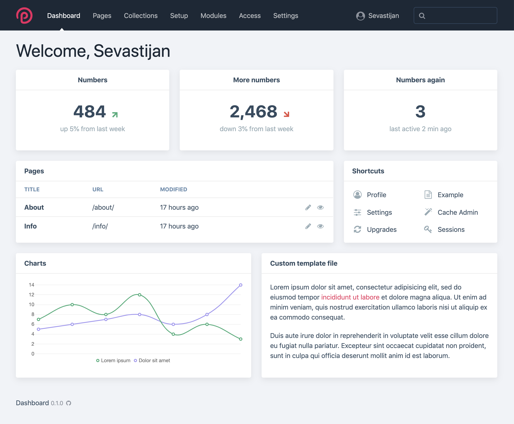

# ProcessWire Dashboard

 
 
 

Display a configurable dashboard in ProcessWire's admin interface. Includes a set of predefined panel types, but can be easily extended to display any content you want.

## Features

- **Multiple Panel Types Available** 
  The module comes bundled with [multiple panel types](panels.md) that should cover 80% of use cases.

- **Easy to Extend** 
  Creating your own panels is easy: you can either [render a template file](panels/template.md) or [create your own panel types](panels/custom.md) by creating a ProcessWire module.

- **Highly Configurable** 
  You're free to [customize panels](getting-started.md#configuring-panels) in their size, position, title and layout. Panels can be [grouped and nested](panels/groups.md) to create whatever layout you need.

- **Configuration as Code** 
  All configuration is done as code. This meets two objectives: the dashboard config can be version-controlled and sensitive credentials are never stored in the database. You are free to supply the data any way you want, preferably using environment variables.

## Contact & Support

- Create a [GitHub issue](https://github.com/daun/processwire-dashboard/issues) for bug reports and feature requests
- Visit the [ProcessWire support forum thread](https://processwire.com/talk/topic/22847-processwire-dashboard/) to ask questions
- Add a [star on GitHub](https://github.com/daun/processwire-dashboard) to support the project

## License

This project is licensed under the [GPL-3.0 license](https://github.com/daun/processwire-dashboard/blob/master/LICENSE).

Copyright (c) Philipp Daun ([@daun](https://github.com/daun/))
